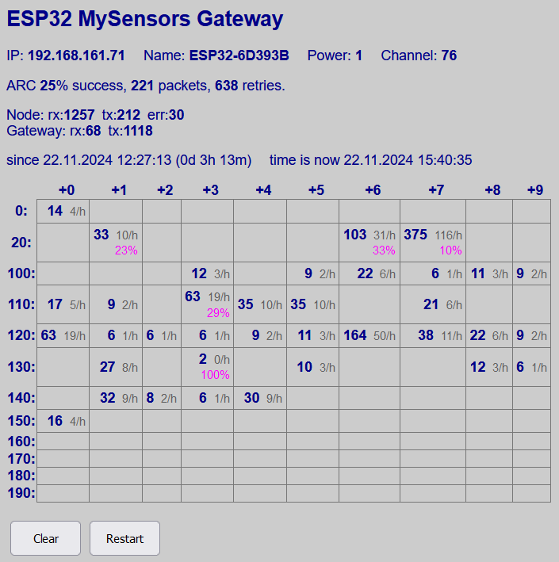
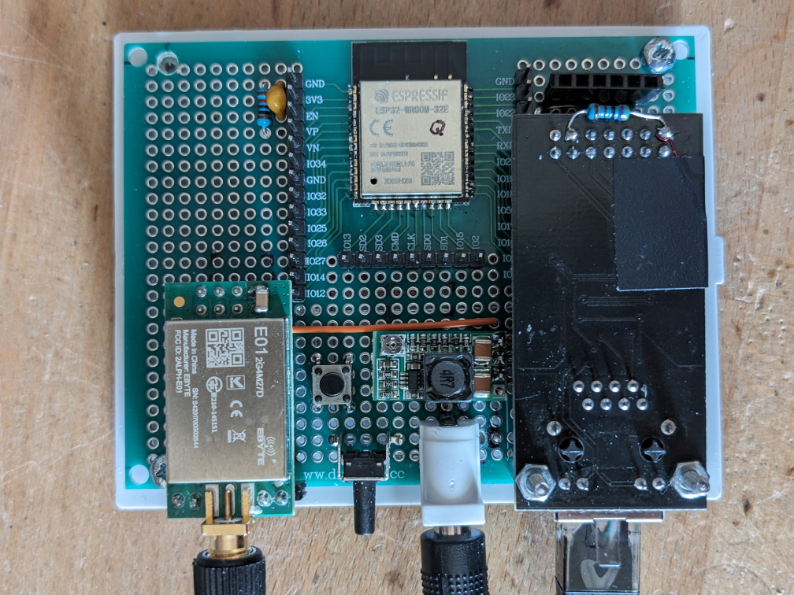

MySensors Ethernet Gateway with ESP32
====

- [MySensors Ethernet Gateway with ESP32](#mysensors-ethernet-gateway-with-esp32)
  - [Objective](#objective)
  - [Features](#features)
  - [Building the Ethernet ESP32 gateway](#building-the-ethernet-esp32-gateway)
    - [Development environment](#development-environment)
    - [Installation](#installation)
    - [Hardware](#hardware)
  - [Modifications to the MySensors library](#modifications-to-the-mysensors-library)
    - [ESP32 gateway via Ethernet](#esp32-gateway-via-ethernet)
    - [Separate tasks for `loop()` and `_process()`](#separate-tasks-for-loop-and-_process)
    - [Connecting the RF24 radio module](#connecting-the-rf24-radio-module)
    - [New notification functions](#new-notification-functions)


## Objective

I needed a gateway that does not depend on a reliable WiFi connection, so Ethernet 
was the only option.

The MySensors website has instructions for how to build an _Ethernet_-based gateway 
(with an ATmega processor) or a gateway using an ESP8266 or ESP32 processor 
(with WiFi connection), but the combination of ESP32 processor and Ethernet connection 
requires some tweaks to the MySensors library, as I found out.

The ESP32 processor is already designed to be used with Ethernet, using a LAN8720 
interface module, which is available from Aliexpress etc. for under €3. This combination 
is well supported by the Arduino universe and the _ETH_ library. To work properly, 
the module needs one minor modification, as described [here](https://mischianti.org/integrating-lan8720-with-esp32-for-ethernet-connectivity-with-plain-http-and-ssl-https/) 
or [here](https://sautter.com/blog/ethernet-on-esp32-using-lan8720/).

## Features

The firmware implements 
* a MySensors _gateway_, that translates between RF24 messages and MQTT messages, 
  like the [example sketch](https://www.mysensors.org/apidocs/GatewayESP32_8ino_source.html) from the MySensors library, or
* a MySensors _repeater_, which re-transmits RF24 messages from a node to the gateway 
  and vice versa

In addition, there are a couple of additional features:

* a simple **Web UI** showing basic information about the device, and statistics 
  about message traffic:
  * IP address and hostname
  * (for a repeater) MySensors Node ID, and the Node ID of the parent
  * Automatic Retry Count (ARC) statistics: the number P of messages sent, the number R 
  of retries needed to succeed, and the "success rate" S = P/(P+R) in percent
  * the total number of messages sent and received, and the number or errors that 
  could not be recovered
  * (for a gateway) the total number of messages sent to and received from the controller
  * finally, a table of the number of messages received from each node, as a total tally, 
  and as an average rate (messages/hour), as well as the "success rate" (see above) for sending messages to each node id
* **over-the-air firmware update** is supported using the standard `ArduinoOTA`library
* an optional **DS18B20 temperature sensor** can be read and reported via MQTT, 
  if (like me) you have concerns about the temperature inside the plastic case of the device.
* A remote **Syslog** message can be sent on startup, which contains
  * code version information
  * IP and MAC address of the unit
  * the reset reason as reported by the ESP firmware



Example screenshot from the gateway on my MySensors network. In the table, total number of messages received in **bold**, average number of messages received per hour in gray, and success rate for sending messages to a node in pink.

## Building the Ethernet ESP32 gateway

### Development environment

My development environment consists of Visual Studio Code with the Platformio plugin, 
I don't use the Arduino IDE.

### Installation

1. Clone the repository to your computer
2. copy `src/secrets.sample.h` to `src/secrets.h` and enter your WiFi network name 
   and password there
3. edit `platformio.ini` and set COM port names and IP addresses for your system. (I defined environments for three devices, called esp32-P, esp32-Q and esp32-S, for flashing via a serial interface, and via OTA. Your setup will be different.)
4. at the very start of the `src/main.cpp`, look at the `USE_xxx` constants 
  that enable each feature, comment out the ones you don't want.
5. near the start of `src/main.cpp`, look for the section that starts with 
   `#pragma region configuration` and adjust parameters as needed, e.g. the URL of your syslog server (if you have one), the URL of the MQTT broker, etc.

### Hardware

Schematics are [here](hardware/MyRepeater-ESP32-ETH.pdf). I didn't design 
a PCB, just built the Ethernet version on a prototype board with an ESP32 module 
footprint (called "_7x9cm Prototype PCB For ESP8266 ESP32_" on Aliexpress).

 


The gateway sits next to a Fritzbox 7490 router/DSL modem, connected by a short 
Ethernet cable, and powered from one of the USB ports of the router.

For a small WiFi-based repeater, I used a "mini" module on a piece of normal prototype 
board, placed in a wall wart housing (Reichelt P/N SSG 200 SK-I).


## Modifications to the MySensors library

### ESP32 gateway via Ethernet
The MySensors library (version 2.3.2) already contains provisions for an ESP32 based 
gateway, just `#define MY_GATEWAY_ESP32`, and off you go, they even provide an 
[example sketch](https://www.mysensors.org/apidocs/GatewayESP32_8ino_source.html). 
However ... this assumes that the network connection will be via _WiFi_, there is 
no support for a wired Ethernet connection, as far as I can tell.

With my modified version of the MySensors library (included in this repository), 
you either `#define MY_GATEWAY_ESP32_WIFI`, and you get the same behavior as in 
the original, or you `#define MY_GATEWAY_ESP32_ETHERNET` to support a LAN8720 based 
Ethernet interface.

The Ethernet interface must be initialized in _application_ code, ideally before 
the MySensors stuff runs. A good place for this is the `preHwInit()` function 
declared by MySensors as a "weak" function, i.e. it is called early during startup 
if the function is defined in your code, but no error is thrown if you don't define 
a function with this name. See the source code for more details.

### Separate tasks for `loop()` and `_process()`
There are two functions that get called repeatedly during normal operation:
* the Arduino  `loop()` function, which handles all the features implemented by the application
* the MySensors `_process()` function, which handles RF24 communication ... which 
 normally gets called "invisibly" by the MySensors framework

I got the impression that the gateway or repeater runs more reliably (especially 
at lower CPU clock frequencies) if the two functions run in separate tasks, 
so extended calculations or waiting operations in `loop()` won't interfere with 
the regular polling for incoming RF24 packets. 

With my modification to the MySensors library included here, they run in separate 
tasks if the `MY_SEPARATE_PROCESS_TASK` preprocessor macro is defined, e.g. in 
the `platformio.ini` file. Note that both tasks run on the same ESP32 core, the 
other core remains dedicated to networking stuff.

When using separate tasks, the repeater or gateway will work reliably down to 40 MHz CPU frequency (using Ethernet) or 80 MHz (using WiFi).

### Connecting the RF24 radio module

Using the ESP32 Ethernet interface also affects how the NRF24 radio module can be 
connected. You can't use the default SPI port with its default pins on the ESP32, 
because some of those pins are occupied by the Ethernet interface, which, unlike 
other peripherals of the ESP like I2C or SPI, can't have its signals remapped to 
pins of your choice.

Instead of using the default SPI port, a.k.a. SPI3 or SPI(VSPI), we use the "other" 
SPI available on the ESP32, a.k.a. SPI2 or SPI(HSPI). Before you `#include <MySensors.h>`, just say
```
 SPIClass hspi(HSPI);   
 #define RF24_SPI hspi
```
This implies pins MISO=12, MOSI=13, SCK=14, CS=15. I also modified the MySensors 
library so you can `#define` macros named `MY_RF24_MISO_PIN`, `MY_RF24_MOSI_PIN`, 
`MY_RF24_SCK_PIN` and `MY_RF24_CS_PIN`, and the SPI interface will use those custom 
pins if those macros are defined in user code.

### New notification functions
To enable the statistics display, my code must be notified imediately after a message 
has been received (so I can count incoming messages), and after a message has been sent 
(so I can count them, and ask about the number of retries required to successfully 
deliver the message).

Function `void previewMessage(const MyMessage &message)` is called by the modified 
MySensors library right after a message has been received.

Function `void aftertransportSend(const uint8_t nextRecipient, const MyMessage &message)` 
is called by the modified MySensors library right after a message has been sent.

Both functions are declared in the library with the `weak` attribute, i.e. they are 
called if they are defined in the application code, and nothing happens if they are 
not defined in the application code.
